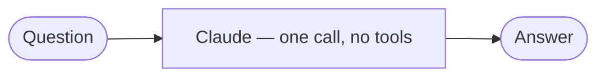
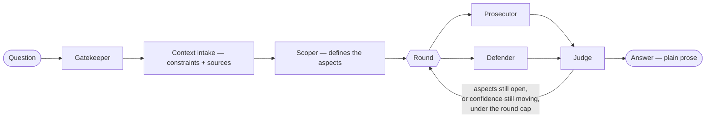

# CourtEval

Adversarial multi-agent evaluation for any proposal, as a Claude Code Skill — not just product ideas. Use it on a business idea, a software architecture decision, a technical design, a refactor plan, or any other "should we do this, and how" question. Instead of asking one model for its opinion, CourtEval runs a courtroom-inspired debate:

- **Prosecutor** attacks the idea, aspect by aspect — isolated from however the idea was originally pitched, so it can't just agree with the framing.
- **Defender** counters with real evidence, isolated the same way — exists specifically so the Prosecutor's skepticism doesn't just win by default.
- **Judge** referees the exchange, tracks confidence round over round, and closes with a rubric, a per-aspect conflict list, and a final **BUILD / KILL / PIVOT** verdict.

No fixed checklist — a **Scoper** step defines 4-5 aspects specific to *this* proposal before the debate starts, so a fintech idea and a microservices-vs-monolith decision get debated on genuinely different terms (regulation/capital/adoption for one, operational complexity/team size/reversibility for the other).

**Context intake:** before picking aspects, CourtEval always asks about hard constraints — budget, timeline, team size, anything non-negotiable — and offers to take reference material too, if you have relevant source material (a compliance policy, legislation, an internal standard, a prior decision). Both Prosecutor and Defender get whatever you provide, symmetrically, and have to quote the exact text to use it. Nothing to add? Say so and it moves straight on.

## Install

```bash
git clone https://github.com/Tomsalvador/courteval.git
```

Then add it as a Claude Code plugin (via `.claude-plugin/marketplace.json` in this repo, or by pointing Claude Code at the cloned path per its plugin-loading docs).

## Use

In a Claude Code session with the plugin loaded, just describe what you want evaluated and ask for a verdict — e.g.:

> "Evaluate this idea with CourtEval: a subscription box that sends you a random book chosen by AI based on your mood that week."

> "Run this architecture decision through CourtEval: moving our monolith to microservices before we've hit any real scaling pain, mainly because it feels like the 'right' way to do it."

Or more directly: `run this through CourtEval: <your proposal>`.

CourtEval will:
1. Sanity-check the input (Gatekeeper)
2. Ask about hard constraints and any reference material (Context intake)
3. Define the aspects worth debating for this specific idea (Scoper)
4. Run up to 2 rounds of real debate between isolated Prosecutor/Defender subagents — dispatched in parallel, on a faster model, stopping early once nothing new is being said (ask for "modo profundo" for a slower, deeper 3-round pass)
5. Give you a direct answer in plain prose — what actually held up, what fell apart, and the verdict with a calibrated confidence stated in a sentence. No rubric, no labeled roles, no transcript dump.

## How it works

A normal question to Claude is one call, no tools:



CourtEval is a real pipeline. Only Prosecutor and Defender run as isolated subagents — Gatekeeper, Context intake, Scoper, and Judge reason in the same ongoing context:



Prosecutor and Defender are dispatched together, in the same turn, so they run in parallel and neither sees the other's output for that round — that's what isolation actually means here. It's meant to be checked, not trusted: look at your own session transcript for two separate subagent invocations per round, not a single model talking to itself.

The round loop stops as soon as any of these is true:
- every aspect has gone a full round with no new objection or counter,
- confidence has held steady for 2 rounds in a row with the same underlying reasoning,
- or the round cap is hit (2 by default, 3 if you ask for "modo profundo").

## What it doesn't do

- No built-in web search or fact-checking — the debate runs on the model's own reasoning, not verified market data. Pair it with a research skill if you need that.
- No persistent memory across sessions — there's no idea history or duplicate-detection beyond the current conversation.
- No cost tracking — a typical evaluation costs roughly 4-7 model calls, usually resolving in 1-2 debate rounds, aiming for about a minute or two rather than several minutes.

See [`skills/courteval/SKILL.md`](skills/courteval/SKILL.md) for the full orchestration logic.

## License

MIT — see [LICENSE](LICENSE).
